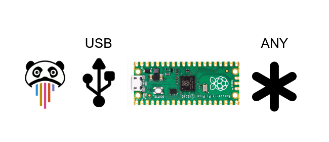

# Pza Devices Project Picoha
Pico Host Adapter is a project to transform the RaspberryPi Pico into host adapter for embeded developers compatible with Panduza

## Requirements

- This project provides multiple firmware, one firmware must support only one feature/interface at a time.
- USB IDs (vendor/model/serial) must allow a unique identification of the device and its function.
- Each firmware must come with at least one python script that demonstrate how to simply use the device.
- Each firmware build must be automated with a github action.
- Each firmware must provides a list of requirement in its README + each requirement must be tested through python examples.
- Each firmware must be coded in RUST
- Each firmware sources must be independant (no shared libraries between projects) => temporary requirement to avoid early unstability

## Merge Archives

Panduza works on the picoha idea since Pico has been released. It is time to merge all the different initiatives.

here are the examples that need to be merge or refactored.

- Zip from directory Archives
- https://github.com/Panduza/picoha-pwm
- https://github.com/Panduza/panduza-rust-pico-io_capture
- https://github.com/Panduza/pzadev-hadapters-dio
- https://github.com/fdmysterious/rs-picoha-io
