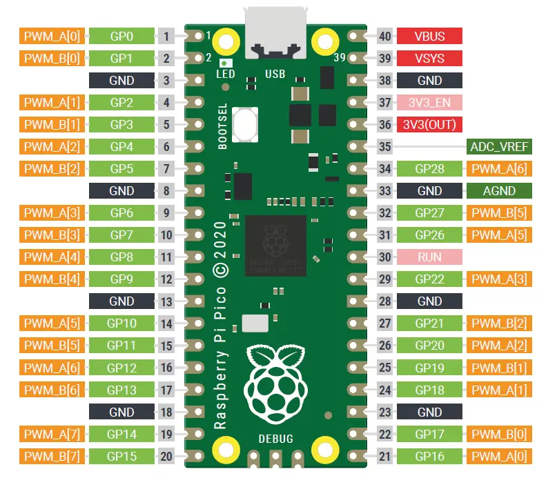

# PWM

- Directory *src* to store the code
- Directory *examples* to store python usages

## Pinout and characteristics

|PWM characteristics 		|Pi Pico		|
|-------------------------- |---------------|
|PWM signal frequency range	|7 Hz to 125 Mhz|
|Independent PWM channels	|8			    |
|PWM output			        |16			    |
|Pulse width resolution	    |16 bits		|

The RP2040 PWM block has 8 identical PWM slices, each with two output channels (A/B), where the B pin can also be used as an input for frequency and duty cycle measurement. That means each slice can drive two PWM output signals, or measure the frequency or duty cycle of an input signal. This gives a total of up to 16 controllable PWM outputs.

## Requirements

### SECTION 1: USB Interface & Protocol

#### [REQ_1000] USB IDs

The product USB IDs **must** be free shared USB VID/PID pair for CDC devices. The products can be differentiated with their manufacturer and product identification and their serial number.

The vendor ID of the device **must** be 0x16C0.

The product ID of the device **must** be 0x05E1.

The iManufacturer of the device **must** be "panduza.io".

The iProduct of the device **must** be "picoha-pwm".

The serial number **must** be XXXX.

#### [REQ_1001] USB Protocol

The USB protocol **must** be a custom protocol named HA and frames are encapsulated in SLIP format.

SLIP modifies a standard datagram by:

- appending a special "END" byte to it, which distinguishes datagram boundaries in the byte stream,
- if the END byte occurs in the data to be sent, the two byte sequence ESC, ESC_END is sent instead,
- if the ESC byte occurs in the data, the two byte sequence ESC, ESC_ESC is sent.
- variants of the protocol may begin, as well as end, packets with END.

|Hex value |Abbreviation|Description            |
|----------|------------|-----------------------|
|0xC0      |END	        |Frame End		        |
|0xDB      |ESC	        |Frame Escape	        |
|0xDC      |ESC_END	    |Transposed Frame End   |
|0xDD      |ESC_ESC	    |Transposed Frame Escape| 

The frames of the custom protocol are composed of:

- a 16 bits request code
- Data
- a 16 bits CRC

|CRC name         |Polynomial|Reversed|XOR-out |
|-----------------|----------|--------|--------|
|`CRC-CCITT-False`|`0x11021` |`False` |`0xFFFF`|

There are two possible transfer mechanisms. For each, there can be only one request at a time before receiving an answer.

- Standard request : the transfer is initiated by the host and wait for an answer from the host adapter
- Notification : the transfer is initiated by the host adapter and wait for an answer from the host

### SECTION 2: Generic Requests and Answers

***Requests***

Generic requests

| Code        | Function  |
| ----------- | --------- |
| `0x0000`    | Ping      |
| `0x0001`    | ItfType   |
| `0x0002`    | Version   |
| `0x0003`    | IdGet     |

***Answers***

Shared answers

| Code        | Function      |
| ----------- | ------------- |
| `0xFFFF`    | Good          |
| `0xFFFE`    | ErrGeneric    |
| `0xFFFD`    | ErrCRC        |
| `0xFFFC`    | ErrUnknownCode|
| `0xFFFB`    | ErrInvalidArgs|
| `0xFFFA`    | ErrBusy       |

Generic answers

| Code        | Function      |
| ----------- | ------------- |
| `0xFEFF`    | VersionResp   |
| `0xFEFE`    | ItfTypeResp   |
| `0xFEFD`    | IdResp        |

### SECTION 3: Features

***PWM Requests***

| Code        | Function        |
| ----------- | --------------  |
| `0x0200`    | PwmStart        |
| `0x0201`    | PwmStop         |
| `0x0202`    | SetFrequency    |
| `0x0203`    | GetFrequency    |
| `0x0204`    | SetDutyCycle    |
| `0x0205`    | GetDutycycle    |

***PWM answers***

| Code        | Function      |
| ----------- | ------------- |
| `0xFCFF`    | Frequency     |
| `0xFCFE`    | DutyCycle     |
| `0xFCFD`    | ErrFrequency  |
| `0xFCFC`    | ErrDutyCycle  |

#### [REQ_2000] PWM Start/Stop:

PWM channels **must** be able to be started and stopped individually. The GPIO's available for PWM signal are GPIO 2,4,6,9,11,13

 The firmware **must** enable PWM of GPIO `X` when the request `0x0200` with the command `X` are received. 
The firmware **must** disable PWM of GPIO `X` when the request `0x2001` with the command `X` are received.

#### [REQ_2001] PWM signal output

The firmware **must** generate a PWM signal on GPIO 2,GPIO 4 and GPIO 6 with customizable parameters such as frequency ranging from 7 Hz to 125 MHz and duty cycle (between 0 and 100%).

 The firmware **must** set the frequency to `N` Hz the GPIO `X` when the request `0x0202` and the command `X_N` are received. 
The firmware **must** set the duty cycle to `N` Hz the GPIO `X` when the request `0x0204` and the command `X_N` are received.

#### [REQ_2002] PWM signal input

The firmware **must** read PWM signal on GPIO 9,GPIO 11 and GPIO 13 for frequency and duty cycle measurement.

 The firmware **must** measure the frequency of GPIO `X` when the request `0x0203` and the command `X` are received. 
The firmware **must** measure the duty cycle of GPIO `X` when the request `0x0205` and the command `X` are received.

#### [REQ_2003] Error status

The firmware **must** support generating errors based on specific events.

The events are : 
- setting the frequency outside the operating interval will return the error code `0xFCFD`.
- setting the duty cycle outside the operating interval will return the error code `0xFCFC`.