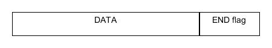
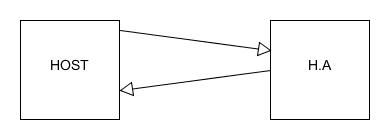

# PWM

- Directory *src* to store the code
- Directory *examples* to store python usages

## Pinout and characteristics


|PWM characteristics 		|Pi Pico		|
|-------------------------- |---------------|
|PWM signal frequency range	|7 Hz to 125 Mhz|
|Independent PWM channels	|8			    |
|PWM output			        |16			    |
|Pulse width resolution	    |16 bits		|

The RP2040 PWM block has 8 identical PWM slices, each with two output channels (A/B), where the B pin can also be used as an input for frequency and duty cycle measurement. That means each slice can drive two PWM output signals, or measure the frequency or duty cycle of an input signal. This gives a total of up to 16 controllable PWM outputs.

## Requirements

### SECTION 1: USB Interface & Protocol


<br/>

#### [REQ_1000] USB IDs

The product USB IDs **must** be free shared USB VID/PID pair for CDC devices. The products can be differentiated with their manufacturer and product identification and their serial number.

The vendor ID of the device **must** be 0x16C0.

The product ID of the device **must** be 0x05E1.

The manufacturer identification of the device **must** be "panduza.io".

The product identification of the device **must** be "picoha-pwm".

The serial number **must** be XXXX.

We chose to use the free shared USB VID/PID instead of the Raspberry Pi VID/PID to assure not to have the product been mistaken with another Raspberry Pi product.

The guidelines to use free USB IDs for shared use are described in the following document: https://github.com/obdev/v-usb/blob/master/usbdrv/USB-IDs-for-free.txt

The guidelines to use Raspberry Pi USB product ID are described in the following document: https://github.com/raspberrypi/usb-pid

#### [REQ_1010] USB device class

The product **must** use USB CDC as its device class.

#### [REQ_1020] USB protocol

The product **must** use Serial Line Internet Protocol (SLIP) as its communication protocol. It is composed of a data payload and a flag that acts as an end delimiter. If this flag is present in the data, then an escape sequence precedes it, so that the receiver does not consider it as the end of the frame.



SLIP flags:

| Hex value   | Abbreviation  | Description             |
| ----------- | ------------- | ----------------------  |
| `0xC0`      | END           | Frame End               |
| `0xDB`      | ESC           | Frame Escape            |
| `0xDC`      | ESC_END       | Transposed Frame End    |
| `0xDD`      | ESC_ESC       | Transposed Frame Escape |

#### [REQ_1030] USB HA protocol

The product **must** use a custom frame protocol named HA protocol. The frames are composed of:


- a 16 bits request code
- Data
- a 16 bits CRC

#### [REQ_1040] HA protocol CRC

The CRC used in the HA protocol frame must use the standard CRC16 crc-ccitt-false. Parameters of this CRC are:

| Parameter   | Value     |
| ----------- | --------- |
| Polynom     | `0x1021`  |
| Init        | `0xFFFF`  |
| Refin       | `false`   |
| Refout      | `false`   |
| Xorout      | `0x0000`  |
| Check       | `0x29B1`  |

Using the crcmod python library, it can be instanciated using the following call:
```
crc16 = crcmod.mkCrcFun(0x11021, rev=False, initCrc=0xFFFF, xorOut=0x0000)
```
Or using its predefined counterpart:
```
crc16 = crcmod.predefined.mkCrcFun("crc-ccitt-false")
```

#### [REQ_1050] HA protocol transfer machanism

There **must** be two possible transfer mechanisms. For each, there can be only one request at a time before receiving an answer.
- Standard request: the transfer is initiated by the host and wait for an answer from the host adapter



- Notification: the transfer is initiated by the host adapter and wait for an answer from the host


<br/>

### SECTION 2: Generic Requests and Answers

***Requests***

Generic requests

| Code        | Function  |
| ----------- | --------- |
| `0x0000`    | Ping      |
| `0x0001`    | ItfType   |
| `0x0002`    | Version   |
| `0x0003`    | IdGet     |

***Answers***

Shared answers

| Code        | Function      |
| ----------- | ------------- |
| `0xFFFF`    | Good          |
| `0xFFFE`    | ErrGeneric    |
| `0xFFFD`    | ErrCRC        |
| `0xFFFC`    | ErrUnknownCode|
| `0xFFFB`    | ErrInvalidArgs|
| `0xFFFA`    | ErrBusy       |

Generic answers

| Code        | Function      |
| ----------- | ------------- |
| `0xFEFF`    | VersionResp   |
| `0xFEFE`    | ItfTypeResp   |
| `0xFEFD`    | IdResp        |

#### [REQ_2000] Ping

The product **must** answer the `Good` (`0xFFFF`) answer when the `Ping` (`0x0000`) request is received.

#### [REQ_2010] Interface type

The product **must** answer the `ItfTypeResp` (`0xFEFE`) answer when the `ItfType` (`0x0001`) request is received. The data returned must be `"picoha-pwm"`.

#### [REQ_2020] Version

The product **must** answer the `VersionResp` (`0xFEFF`) answer when the `Version` (`0x0002`) request is received. The data returned must be version of the firmware loaded on the product.

#### [REQ_2030] ID

The product **must** answer the `IdResp` (`0xFEFD`) answer when the `IdGet` (`0x0003`) request is received. The data returned must be unique board ID of the product.

#### [REQ_2040] Good

The product **must** answer the `Good` (`0xFFFF`) code when no error has been encountered and the request has no specific answer.

#### [REQ_2050] Generic error

The product **must** answer the `ErrGeneric` (`0xFFFE`) code when an error not linked to a preexisting error codde is encountered.

#### [REQ_2060] CRC error

The product **must** answer the `ErrCRC` (`0xFFFD`) code when the CRC of a received request is invalid.

#### [REQ_2070] Unknown code error

The product **must** answer the `ErrUnknownCode` (`0xFFFC`) code when the request code received is unknown.

#### [REQ_2080] Invalid arguments error

The product **must** answer the `ErrInvalidArgs` (`0xFFFB`) code when a request is received with the wrong arguments.

#### [REQ_2090] Busy

The product **must** answer the `ErrBusy` (`0xFFFA`) code when an operation is still in progress and the product is busy.

### SECTION 3: Features

***PWM Requests***

| Code        | Function        |
| ----------- | --------------  |
| `0x0200`    | PwmStart        |
| `0x0201`    | PwmStop         |
| `0x0202`    | SetFrequency    |
| `0x0203`    | GetFrequency    |
| `0x0204`    | SetDutyCycle    |
| `0x0205`    | GetDutycycle    |

***PWM answers***

| Code        | Function      |
| ----------- | ------------- |
| `0xFCFF`    | Frequency     |
| `0xFCFE`    | DutyCycle     |
| `0xFCFD`    | ErrFrequency  |
| `0xFCFC`    | ErrDutyCycle  |

#### [REQ_3000] PWM Start/Stop:

PWM channels **must** be able to be started and stopped individually. The GPIO's available for PWM signal are GPIO 2,4,6,9,11,13

<br>The firmware **must** enable PWM of GPIO `X` when the request `PwmStart` (`0x0200`) with the command `X` are received.<br>
The firmware **must** disable PWM of GPIO `X` when the request `PwmStop` (`0x2001`) with the command `X` are received.


#### [REQ_3010] PWM signal output

The firmware **must** generate a PWM signal on GPIO 2,GPIO 4 and GPIO 6 with customizable parameters such as frequency ranging from 7 Hz to 125 MHz and duty cycle (between 0 and 100%).

<br>The firmware **must** set the frequency to `N` Hz the GPIO `X` when the request `SetFrequency` (`0x0202`) and the command `X_N` are received.<br>
The firmware **must** set the duty cycle to `N` Hz the GPIO `X` when the request `SetDutycycle` (`0x0204`) and the command `X_N` are received.

#### [REQ_3020] PWM signal input

The firmware **must** read PWM signal on GPIO 9,GPIO 11 and GPIO 13 for frequency and duty cycle measurement.

<br>The firmware **must** measure the frequency of GPIO `X` when the request `GetFrequency` (`0x0203`) and the command `X` are received.<br>
The firmware **must** measure the duty cycle of GPIO `X` when the request `GetDutycycle`(`0x0205`) and the command `X` are received.

#### [REQ_3030] Error status

The firmware **must** support generating errors based on specific events.

The events are : 
- setting the frequency outside the operating interval will return the error code `ErrFrequency` (`0xFCFD`).
- setting the duty cycle outside the operating interval will return the error code `ErrDutyCycle` (`0xFCFC`).