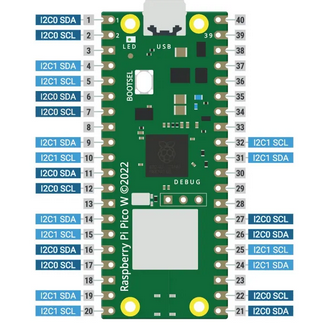
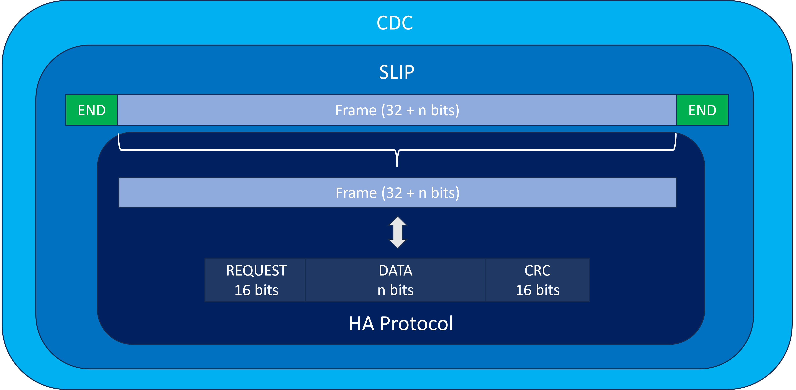
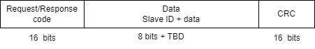

# I2C Master

- Directory *src* to store the code
- Directory *examples* to store python usages

### SECTION 0: Pins Configuration




| Pin Numbers | I2C communication lines |
| ---------   | --------- |
| **Pin 21**  | I2C0 SDA   |
| **Pin 22**  | I2C0 SCL   |
| **Pin 23**  | GND   |


## Requirements


### SECTION 1: USB Interface & Protocol




#### [REQ_1000] USB IDs

- The product USB IDs **must** be free shared USB VID/PID pair for CDC devices. The products can be differentiated with their manufacturer and product identification and their serial number.

- The vendor ID of the device **must** be ```0x16C0```.

- The product ID of the device **must** be ```0x05E1```.

- The manufacturer identification of the device **must** be ```"panduza.io"```.

- The product identification of the device **must** be ```"picoha-uart"```.

- The serial number of the device **must** be XXXX.

We chose to use the free shared USB VID/PID instead of the Raspberry Pi VID/PID to assure not to have the product been mistaken with another Raspberry Pi product.

The guidelines to use free USB IDs for shared use are described in the following document: https://github.com/obdev/v-usb/blob/master/usbdrv/USB-IDs-for-free.txt

The guidelines to use Raspberry Pi USB product ID are described in the following document: https://github.com/raspberrypi/usb-pid

#### [REQ_2000] USB Protocol : HA protocol

- The product **must** use the HA protocol based on CDC protocol and SLIP frame format
- The product **must** use the request and response code established by the protocol HA such as generic requests and the allocation memory of I2C master protocol
- The request and response code **must** have a size 16 bits

SLIP modifies a standard datagram by:

- appending a special "END" byte to it, which distinguishes datagram boundaries in the byte stream,
- if the END byte occurs in the data to be sent, the two byte sequence ESC, ESC_END is sent instead,
- if the ESC byte occurs in the data, the two byte sequence ESC, ESC_ESC is sent.
- variants of the protocol may begin, as well as end, packets with END.

| Hex value | Abbreviation | Description |
| ---------   | --------- | -------------|
| **0xC0**  | END   | Frame End |
| **0xDB**  | ESC   | Frame Escape |
| **0xDC**  | ESC_END   | Transposed Frame End |
| **0xDD**  | ESC_ESC | Transported Frame Escape |

The frames of the custom protocol are composed of:

- a 16 bits request code
- Data
- a 16 bits CRC

 CRC name | Polynomial | Reversed | XOR-out |
| ---------   | --------- | -------------| ------ |
| ```CRC-CCITT-False```  | ```0x11021```   | ```False``` | ```0xFFFF``` |

There are two possible transfer mechanisms. For each, there can be only one request at a time before receiving an answer.

- Standard request : the transfer is initiated by the host and wait for an answer from the host adapter
- Notification : the transfer is initiated by the host adapter and wait for an answer from the host

### SECTION 2: Generic Requests and Answers

**Requests**

Generic requests

| Code| Function |
| ---------   | --------- |
| ```0x0000```  | Ping  |
| ```0x0001```  | ItfType   |
| ```0x0002```  | Version   |
| ```0x0003```  | IdGet   |

**Answers**

Shared answers

| Code| Function |
| ---------   | --------- |
| ```0xFFFF```  | Good  |
| ```0xFFFE```  | ErrGeneric   |
| ```0xFFFD```  | ErrCRC   |
| ```0xFFFC```  | ErrUnknownCode  |
| ```0xFFFB```  | ErrInvalidArgs   |
| ```0xFFFA```  | ErrBusy   |

Generic answers

| Code| Function |
| ---------   | --------- |
| ```0xFEFF```  | VersionResp  |
| ```0xFEFE```  | ItfTypeResp   |
| ```0xFEFD```  | IdResp   |


#### [REQ_2000] Ping
The product must answer the Good ```0xFFFF``` answer when the Ping (0x0000) request is received.

#### [REQ_2010] Interface type
The product must answer the ItfTypeResp ```0xFEFE``` answer when the ItfType (0x0001) request is received. The data returned must be "picoha-pwm".

#### [REQ_2020] Version
The product must answer the VersionResp ```0xFEFF``` answer when the Version (0x0002) request is received. The data returned must be version of the firmware loaded on the product.

#### [REQ_2030] ID
The product must answer the IdResp ```0xFEFD``` answer when the IdGet (0x0003) request is received. The data returned must be unique board ID of the product.

#### [REQ_2040] Good
The product must answer the Good ```0xFFFF``` code when no error has been encountered and the request has no specific answer.

#### [REQ_2050] Generic error
The product must answer the ErrGeneric ```0xFFFE``` code when an error not linked to a preexisting error codde is encountered.

#### [REQ_2060] CRC error
The product must answer the ErrCRC ```0xFFFD``` code when the CRC of a received request is invalid.

#### [REQ_2070] Unknown code error
The product must answer the ErrUnknownCode ```0xFFFC``` code when the request code received is unknown.

#### [REQ_2080] Invalid arguments error
The product must answer the ErrInvalidArgs ```0xFFFB``` code when a request is received with the wrong arguments.

#### [REQ_2090] Busy
The product must answer the ErrBusy ```0xFFFA``` code when an operation is still in progress and the product is busy.


### SECTION 3: Features

#### [REQ_3000] I2C slave ID

- The product **must** allow the user to configure I2C slave address by adding it in the SLIP frame in normal mode (**7 bits**) and extended mode (**10 bits**) 

#### [REQ_3010] Write data

- The product **must** allow the user to write a message to I2C slave
- Request code => ```0x3B00```
- Response code => ```0xB300```
- The frame **must** containe the slave address



#### [REQ_3020] Read data

- The product **must** allow the user to read a message to I2C slave
- Request code => ```0x3B01```
- Response code => ```0xB301```
- The frame **must** containe the slave address


#### [REQ_3030] Write-Read Operation (Combined Write and Read)

- The product **must** allow the user to combine write and read operations performed sequentially
- Request code => ```0x3B02```
- Response code => ```0xB302```
- The frame **must** containe the slave address

#### [REQ_3040] Start and Stop conditions

- The product **must** generate the **Start** and the **Stop** conditions in order begin and end a transaction

#### [REQ_3050] Clock Synchronization

- The product **must** generate the clock signal in order to controls the timing of data transmission.

#### [REQ_3060] Clock Speed Configuration

- The product **must**  support the configuration of clock speeds or bit rates (100 Kbps, 400 Kbps, 1 Mbps) to accommodate various communication requirements.
- Request code => ```0x3B03```
- Response code => ```0xB303```

#### [REQ_3070] Error Handling

- The product **must** handle error such as Acknowledge error and timeout handling (slave unresponsive)

#### [REQ_3080] I2C STOP

- The product **must** allow the user to stop the I2C communication at any time during communication
- Request code => ```0x3B04```
- Response code => ```0xB304```