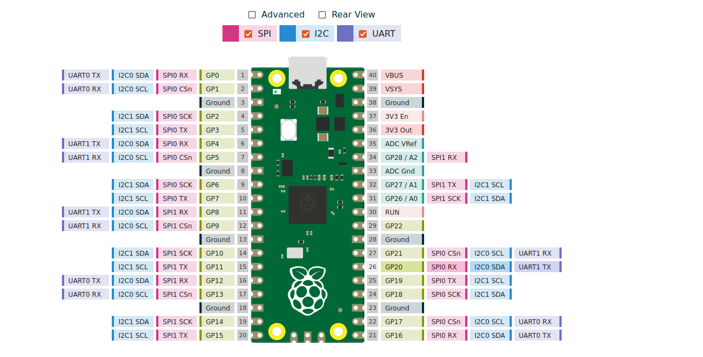
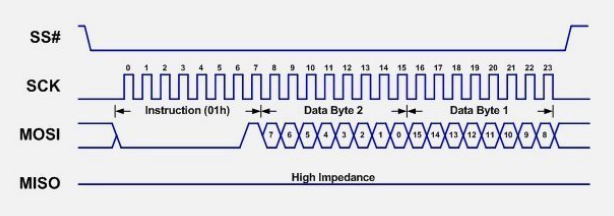
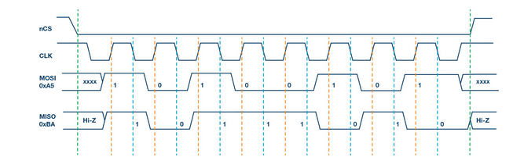

# SPI master

## Requirements

### SECTION 1 : Target and protocol

#### [REQ_1000] Microcontroller

To develop the SPI host adapter, the firmware must be implemented in the Raspberry Pi Pico

#### [REQ_2000] SPI protocol

To communicate threw SPI, the following transaction must be followed:  

### SECTION 2 : USB Interface & Protocol

#### [REQ_3000] USB IDs

**
The product_id of the PICO must be 05e1
**
**
The vendor_id of the PICO must be 16c0
**
**
The serial_short of the PICO must be Picoha-spi-master/p>**

#### [REQ_4000] USB Protocol

**A custom protocol must be used to tranfert data by USB. The custom protocol is based on the serial line internet protocol**

### SECTION 2: Features

To communicate with SPI, a code request has to be send to the firmware for each operations

|  Code  |   function              |
| -------      | ------------------------|     
|    0x000       |      polarity mode 0       | 
|    0x001       |  polarity mode 1  |
|    0x002       |   polarity mode 2   |  
|    0x003       |  polarity mode 3   |
|    0x005       |  Enable interrupt  |
|    0x006       |      Select and send clock frequency         | 
|    0x007       |  Select the slave device  |
|    0x008       |   write to slave   |  
|    0x009       |  read from slave  |
|    0x0A       |  Enable interrupt  |
|    0x0B       |  Disable interrupt  |

#### [REQ_5000] Pin of PICO
**The following pin must be used :**

|   PIN used   |   function              |   type | Idle state |
| -------      | ------------------------|--------|------------|          
|    GP6       |   SPI clock             | OUTPUT |   HIGH     | 
|    GP7       |  SPI Transfert (MOSI)   | OUTPUT |   HIGH     | 
|    GP8       |   SPI Receive (MISO)    | Input  |   HIGH     |   
|    GP9       |  SPI Chip Select (CS)   | OUTPUT |   HIGH     | 
|    GP25      |    Pico Internal LED    | OUTPUT |   LOW      | 

#### [REQ_6000] SPI polarity mode
**The polarity mode will be the mode 3**

request code polarity mode 0 = 0x000
request code polarity mode 1 = 0x001
request code polarity mode 2 = 0x003
request code polarity mode 3 = 0x004
All pins of SPI must be at high during idle state (Cf REQ_5000)

#### [REQ_7000] Start of the program
**The internal led must be on, during the start and the execution of the firmware**

#### [REQ_8000] End of the program
**The internal led must be turned off, when the program is stoped**

#### [REQ_9000] SPI desconnected
**The firmware must still be running when the SPI connections are disconnected**

#### [REQ_10000] clock frequency
**When the firmware starts, the GPIO 6 must deliver a 125KHz clock frequency**
request code = 0x006

#### [REQ_20000] slave select
**When the firmware starts, the GPIO 9 must be in high level**
request code = 0x007

#### [REQ_30000] write to slave
**When the initiates the communication, it must send the Read byte followed by the slave address**
request code = 0x008

#### [REQ_40000] response from slave
**The GPIO 8 must be able to read a ACK frame and data bytes from the slave device**
request code = 0x009

#### [REQ_50000] Interrupt mode
**The firmware must be able to manage a interrupt mode**
request code enable IRQ = 0x0A
request code disable IRQ = 0x0B

#### [REQ_60000] unused pins
**The unused pins of the PICO must be configured as inputs**