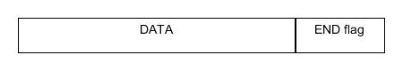
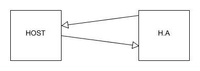
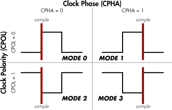

# SPI

- Directory *src* to store the code
- Directory *examples* to store python usages

## Sommaire
- [SPI](#spi)
  - [Sommaire](#sommaire)
  - [Requirements](#requirements)
    - [SECTION 1: USB Interface \& Protocol](#section-1-usb-interface--protocol)
      - [\[REQ\_1000\] USB IDs](#req_1000-usb-ids)
      - [\[REQ\_1010\] USB device class](#req_1010-usb-device-class)
      - [\[REQ\_1020\] USB protocol](#req_1020-usb-protocol)
      - [\[REQ\_1030\] USB HA protocol](#req_1030-usb-ha-protocol)
      - [\[REQ\_1040\] HA protocol CRC](#req_1040-ha-protocol-crc)
      - [\[REQ\_1050\] HA protocol transfer machanism](#req_1050-ha-protocol-transfer-machanism)
    - [SECTION 2: Generic Requests](#section-2-generic-requests)
      - [\[REQ\_2000\] Ping](#req_2000-ping)
      - [\[REQ\_2010\] Interface type](#req_2010-interface-type)
      - [\[REQ\_2020\] Version](#req_2020-version)
      - [\[REQ\_2030\] ID](#req_2030-id)
      - [\[REQ\_2040\] Good](#req_2040-good)
      - [\[REQ\_2050\] Generic error](#req_2050-generic-error)
      - [\[REQ\_2060\] CRC error](#req_2060-crc-error)
      - [\[REQ\_2070\] Unknown code error](#req_2070-unknown-code-error)
      - [\[REQ\_2080\] Invalid arguments error](#req_2080-invalid-arguments-error)
      - [\[REQ\_2090\] Busy](#req_2090-busy)
    - [SECTION 3: SPI Requests](#section-3-spi-requests)
      - [\[REQ\_3000\] transmit](#req_3000-transmit)
      - [\[REQ\_3010\] Set mode](#req_3010-set-mode)
      - [\[REQ\_3020\] Get mode](#req_3020-get-mode)
      - [\[REQ\_3030\] Slave Select Polarity](#req_3030-slave-select-polarity)
      - [\[REQ\_3040\] Set bite rate](#req_3040-set-bite-rate)
      - [\[REQ\_3050\] Get bite rate](#req_3050-get-bite-rate)
      - [\[REQ\_3060\] bite order](#req_3060-bite-order)
      - [\[REQ\_3070\] Frame format](#req_3070-frame-format)
    - [SECTION 4: Features](#section-4-features)
      - [\[REQ\_4000\] SPI pinout](#req_4000-spi-pinout)


## Requirements

### SECTION 1: USB Interface & Protocol


<br/>

#### [REQ_1000] USB IDs

The product USB IDs **must** be free shared USB VID/PID pair for CDC devices. The products can be differentiated with their manufacturer and product identification and their serial number.

The vendor ID of the device **must** be 0x16C0.

The product ID of the device **must** be 0x05E1.

The manufacturer identification of the device **must** be `"panduza.io"`.

The product identification of the device **must** be `"picoha-spi"`.

The serial number of the device **must** be XXXX.

We chose to use the free shared USB VID/PID instead of the Raspberry Pi VID/PID to assure not to have the product been mistaken with another Raspberry Pi product.

The guidelines to use free USB IDs for shared use are described in the following document: https://github.com/obdev/v-usb/blob/master/usbdrv/USB-IDs-for-free.txt

The guidelines to use Raspberry Pi USB product ID are described in the following document: https://github.com/raspberrypi/usb-pid

#### [REQ_1010] USB device class

The product **must** use USB CDC as its device class.

#### [REQ_1020] USB protocol

The product **must** use Serial Line Internet Protocol (SLIP) as its communication protocol. It is composed of a data payload and a flag that acts as an end delimiter. If this flag is present in the data, then an escape sequence precedes it, so that the receiver does not consider it as the end of the frame.



SLIP flags:

| Hex value   | Abbreviation  | Description             |
| ----------- | ------------- | ----------------------  |
| `0xC0`      | END           | Frame End               |
| `0xDB`      | ESC           | Frame Escape            |
| `0xDC`      | ESC_END       | Transposed Frame End    |
| `0xDD`      | ESC_ESC       | Transposed Frame Escape |

#### [REQ_1030] USB HA protocol

The product **must** use a custom frame protocol named HA protocol. The frames are composed of:


- a 16 bits request code
- Data
- a 16 bits CRC

#### [REQ_1040] HA protocol CRC

The CRC used in the HA protocol frame must use the standard CRC16 crc-ccitt-false. Parameters of this CRC are:

| Parameter   | Value     |
| ----------- | --------- |
| Polynom     | `0x1021`  |
| Init        | `0xFFFF`  |
| Refin       | `false`   |
| Refout      | `false`   |
| Xorout      | `0x0000`  |
| Check       | `0x29B1`  |

Using the crcmod python library, it can be instanciated using the following call:
```
crc16 = crcmod.mkCrcFun(0x11021, rev=False, initCrc=0xFFFF, xorOut=0x0000)
```
Or using its predefined counterpart:
```
crc16 = crcmod.predefined.mkCrcFun("crc-ccitt-false")
```

#### [REQ_1050] HA protocol transfer machanism

There **must** be two possible transfer mechanisms. For each, there can be only one request at a time before receiving an answer.
- Standard request: the transfer is initiated by the host and wait for an answer from the host adapter


- Notification: the transfer is initiated by the host adapter and wait for an answer from the host



<br/>

### SECTION 2: Generic Requests

***Generic requests***

| Code        | Function  |
| ----------- | --------- |
| `0x0000`    | Ping      |
| `0x0001`    | ItfType   |
| `0x0002`    | Version   |
| `0x0003`    | IdGet     |

***Shared answers***

| Code        | Function      |
| ----------- | ------------- |
| `0xFFFF`    | Good          |
| `0xFFFE`    | ErrGeneric    |
| `0xFFFD`    | ErrCRC        |
| `0xFFFC`    | ErrUnknownCode|
| `0xFFFB`    | ErrInvalidArgs|
| `0xFFFA`    | ErrBusy       |

***Generic answers***

| Code        | Function      |
| ----------- | ------------- |
| `0xFEFF`    | VersionResp   |
| `0xFEFE`    | ItfTypeResp   |
| `0xFEFD`    | IdResp        |

#### [REQ_2000] Ping

The product **must** answer the `Good` (`0xFFFF`) answer when the `Ping` (`0x0000`) request is received.

#### [REQ_2010] Interface type

The product **must** answer the `ItfTypeResp` (`0xFEFE`) answer when the `ItfType` (`0x0001`) request is received. The data returned must be `"picoha-uart"`.

#### [REQ_2020] Version

The product **must** answer the `VersionResp` (`0xFEFF`) answer when the `Version` (`0x0002`) request is received. The data returned must be version of the firmware loaded on the product.

#### [REQ_2030] ID

The product **must** answer the `IdResp` (`0xFEFD`) answer when the `IdGet` (`0x0003`) request is received. The data returned must be unique board ID of the product.

#### [REQ_2040] Good

The product **must** answer the `Good` (`0xFFFF`) code when no error has been encountered and the request has no specific answer.

#### [REQ_2050] Generic error

The product **must** answer the `ErrGeneric` (`0xFFFE`) code when an error not linked to a preexisting error codde is encountered.

#### [REQ_2060] CRC error

The product **must** answer the `ErrCRC` (`0xFFFD`) code when the CRC of a received request is invalid.

#### [REQ_2070] Unknown code error

The product **must** answer the `ErrUnknownCode` (`0xFFFC`) code when the request code received is unknown.

#### [REQ_2080] Invalid arguments error

The product **must** answer the `ErrInvalidArgs` (`0xFFFB`) code when a request is received with the wrong arguments.

#### [REQ_2090] Busy

The product **must** answer the `ErrBusy` (`0xFFFA`) code when an operation is still in progress and the product is busy.

### SECTION 3: SPI Requests

***SPI requests***

| Code        | Function      |
| ----------- | ------------- |
| `0xA000`    | Transmit      |
| `0xA001`    | SetMode       |
| `0xA002`    | getMode       |
| `0xA003`    | SetCS_polH    |
| `0xA004`    | SetCS_polL    |
| `0xA005`    | getCS_pol     |
| `0xA006`    | SetBitRate    |
| `0xA007`    | GetBitRate    |
| `0xA008`    | SetMSB        |
| `0xA009`    | SetLSB        |
| `0xA010`    | getBitOrder   |

#### [REQ_3000] transmit

The product **must** transmit data on SPI bus when the `Transmit` (`0xA000`) command is received. An input data buffer and an ouput data buffer are require.

#### [REQ_3010] Set mode

The product **must** be able to configure CPOL and CPHA following 4 existing mode ID. The request code to set the mode is `SetMode` (`0xA001`).

| Mode ID |     Description     |
| ------- | ------------------- |
|    0    | CPOL = 0 / CPHA = 0 |
|    1    | CPOL = 0 / CPHA = 1 |
|    2    | CPOL = 1 / CPHA = 0 |
|    3    | CPOL = 1 / CPHA = 1 |



#### [REQ_3020] Get mode

The product **must** provide a way to retrieve configured mode ID. The request code to get the mode is `GetMode` (`0xA002`).

#### [REQ_3030] Slave Select Polarity

The product **must** be able to configure Chip Select (CS) polarity. Slave select can be active Low or active High.

The request code to set CS as active High is `SetCS_polH` (`0xA003`).

The request code to set CS as active Low is `SetCS_polL` (`0xA004`).

The request code to get CS polarity configuration is `getCS_pol` (`0xA005`).

By default Chip Select should be **Active Low**.

#### [REQ_3040] Set bite rate

The product **must** provide a way to change the bite rate in Hz. The request code to set the bite rate is `SetBitRate` (`0xA006`). 

Bit rate must be in the supported clock range: [ ??? ]

#### [REQ_3050] Get bite rate

The product **must** provide a way to get the bite rate. The request code to get the bite rate is `GetBitRate` (`0xA007`). 

#### [REQ_3060] bite order

The product **must** provide a way to set the bite order.

The request code to set the bite order as MSB is `SetMSB` (`0xA008`).

The request code to set the bite order as LSB is `SetLSB` (`0xA009`).

The request code to get the bite order configuration is `getBitOrder` (`0xA010`).

By default bite order should be **MSB**.

#### [REQ_3070] Frame format

The product use the default Motorola frame format

### SECTION 4: Features

#### [REQ_4000] SPI pinout

|   PIN used   |   function |
| -------      | ---------- |
|    GP2       |   clock    |
|    GP3       |   MOSI     |
|    GP4       |   MISO     |
|    GP5       |   CS       |
