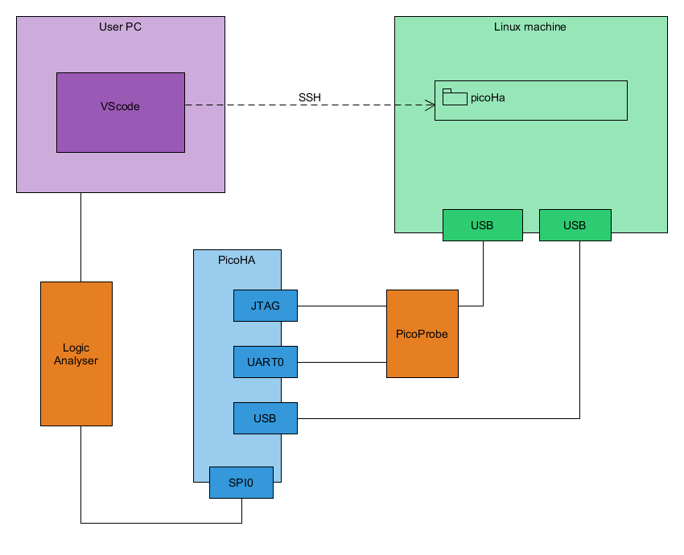

# SPI indermediate objectives

- [SPI indermediate objectives](#spi-indermediate-objectives)
  - [Requirements](#requirements)
      - [\[REQ\_0001\] USB serial](#req_0001-usb-serial)
      - [\[REQ\_0002\] SPI](#req_0002-spi)
      - [\[REQ\_0003\] Echo](#req_0003-echo)
  - [Set-up](#set-up)

## Requirements

#### [REQ_0001] USB serial

Firmware should provide a basic USB serial.

#### [REQ_0002] SPI

Firmware should provide a basic SPI. SPI0 instance of RP2040 is used.

#### [REQ_0003] Echo

Firmware should echo on the SPI any data received on USB serial.

## Set-up

