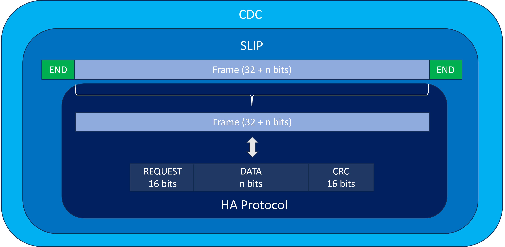
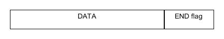
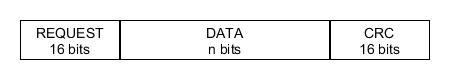
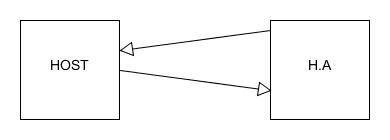

# UART

- Directory *src* to store the code
- Directory *examples* to store python usages

## Requirements

### SECTION 1: USB Interface & Protocol


<br/>

#### [REQ_1000] USB IDs

The product USB IDs **must** be free shared USB VID/PID pair for CDC devices. The products can be differentiated with their manufacturer and product identification and their serial number.

The vendor ID of the device **must** be 0x16C0.

The product ID of the device **must** be 0x05E1.

The manufacturer identification of the device **must** be `"panduza.io"`.

The product identification of the device **must** be `"picoha-uart"`.

The serial number of the device **must** be XXXX.

We chose to use the free shared USB VID/PID instead of the Raspberry Pi VID/PID to assure not to have the product been mistaken with another Raspberry Pi product.

#### [REQ_1010] USB device class

The product **must** use USB CDC as its device class.

#### [REQ_1020] USB protocol

The product **must** use Serial Line Internet Protocol (SLIP) as its communication protocol. It is composed of a data payload and a flag that acts as an end delimiter. If this flag is present in the data, then an escape sequence precedes it, so that the receiver does not consider it as the end of the frame.



SLIP flags:

| Hex value   | Abbreviation  | Description             |
| ----------- | ------------- | ----------------------  |
| `0xC0`      | END           | Frame End               |
| `0xDB`      | ESC           | Frame Escape            |
| `0xDC`      | ESC_END       | Transposed Frame End    |
| `0xDD`      | ESC_ESC       | Transposed Frame Escape |

#### [REQ_1030] USB HA protocol

The product **must** use a custom frame protocol named HA protocol. The frames are composed of:



- a 16 bits request code
- Data
- a 16 bits CRC

#### [REQ_1040] HA protocol CRC

The CRC used in the HA protocol frame must use the standard CRC16 crc-ccitt-false. Parameters of this CRC are:

| Parameter   | Value     |
| ----------- | --------- |
| Polynom     | `0x1021`  |
| Init        | `0xFFFF`  |
| Refin       | `false`   |
| Refout      | `false`   |
| Xorout      | `0x0000`  |
| Check       | `0x29B1`  |

Using the crcmod python library, it can be instanciated using the following call:
```
crc16 = crcmod.mkCrcFun(0x11021, rev=False, initCrc=0xFFFF, xorOut=0x0000)
```
Or using its predefined counterpart:
```
crc16 = crcmod.predefined.mkCrcFun("crc-ccitt-false")
```

#### [REQ_1050] HA protocol transfer machanism

There **must** be two possible transfer mechanisms. For each, there can be only one request at a time before receiving an answer.
- Standard request: the transfer is initiated by the host and wait for an answer from the host adapter


- Notification: the transfer is initiated by the host adapter and wait for an answer from the host



<br/>

### SECTION 2: Generic Requests

***Generic requests***

| Code        | Function  |
| ----------- | --------- |
| `0x0000`    | Ping      |
| `0x0001`    | ItfType   |
| `0x0002`    | Version   |
| `0x0003`    | IdGet     |

***Shared answers***

| Code        | Function      |
| ----------- | ------------- |
| `0xFFFF`    | Good          |
| `0xFFFE`    | ErrGeneric    |
| `0xFFFD`    | ErrCRC        |
| `0xFFFC`    | ErrUnknownCode|
| `0xFFFB`    | ErrInvalidArgs|
| `0xFFFA`    | ErrBusy       |

***Generic answers***

| Code        | Function      |
| ----------- | ------------- |
| `0xFEFF`    | VersionResp   |
| `0xFEFE`    | ItfTypeResp   |
| `0xFEFD`    | IdResp        |

#### [REQ_2000] Ping

The product **must** answer when the ping request `0x0000` is received with the good answer `0xFFFF`.

#### [REQ_2010] Interface type

The product **must** answer when the ItfType request `0x0001` is received with the ItfTypeResp answer `0xFEFE`. The data returned must be `"picoha-uart"`.

#### [REQ_2020] Version

The product **must** answer when the Version request `0x0002` is received with the VersionResp answer `0xFEFF`. The data returned must be version of the firmware loaded on the product.

#### [REQ_2030] ID

The product **must** answer when the IdGet request `0x0003` is received with the IdResp answer `0xFEFD`. The data returned must be unique board ID of the product.

#### [REQ_2040] Good

The product **must** answer the code `0xFFFF` when no error has been encountered.

#### [REQ_2050] Generic error

The product **must** answer the code `0xFFFE` when a generic error is encountered.

#### [REQ_2060] CRC error

The product **must** answer the code `0xFFFD` when a CRC error is encountered.

#### [REQ_2070] Unknown code error

The product **must** answer the code `0xFFFC` when an unknown code error is encountered.

#### [REQ_2080] Invalid arguments error

The product **must** answer the code `0xFFFB` when an invalid arguments error is encountered.

#### [REQ_2090] Busy error

The product **must** answer the code `0xFFFA` when a busy error is encountered.

### SECTION 3: UART Requests

| UART Setting | Range              | Default     |
| -----------  | ------------------ | ----------- |
| Baudrate     | up to 15.625 Mbaud | 115200 baud |
| Parity bit   | 0 to 1 bit         | 0 bit       |
| Stop bits    | 1 to 2 bits        | 1 bit       |
| Data bits    | 5 to 9 bits        | 8 bits      |

***UART requests***

| Code        | Function  |
| ----------- | --------- |
| `0x1000`    | DataTX    |
| `0x1001`    | DataRXGet |
| `0x1002`    | BaudSet   |
| `0x1003`    | BaudGet   |
| `0x1004`    | SetParity |
| `0x1005`    | SetStopBit|
| `0x1006`    | SetDataSz |
| `0x1007`    | StopCom   |

***UART answers***

| Code        | Function      |
| ----------- | ------------- |
| `0xEFFF`    | DataRX        |
| `0xEFFE`    | Baud          |

#### [REQ_3000] Send data

The product **must** send data to one other product using UART communication when the command `0x1000` is received.

#### [REQ_3010] Receive data

The product **must** receive data from one other product using UART communication when the command `0x1001` is received.

#### [REQ_3020] Write baud rate

The product **must** provide a way to change the baudrate. The request code to set the baudrate is `0x1002`. The baud rate can be out of the standards baud rates used in UART.

#### [REQ_3030] Read baud rate

The product **must** provide a way to read the baudrate. The request code to read the baudrate is `0x1003`. The product must answer the baudrate value with the code `0xEFFE`.

#### [REQ_3040] Parity

The product **must** configure the parity bit when the command `0x1004` is received. The parity bit can be set to 0 or 1 with the default value set to 0.

#### [REQ_3050] Stop bits

The product **must** configure the stop bits when the command `0x1005` is received. The stop bit can be set to 1 or 2 with the default value set to 1.

#### [REQ_3060] Data size

The product **must** configure the data size when the command `0x1006` is received. The data size can be set to 5, 6, 7, 8 or 9 with the default value set to 8.

### SECTION 4: Features

#### [REQ_4000] UART pinout

The product UART TX is connected to GP0 and the UART RX is connected to GP1.

#### [REQ_4010] Hardware flow control

The product **must** enable hardware flow control.

#### [REQ_4020] Hardware flow control pinout

The product CTS is connected to GP2 and the RTS is connected to GP3.

#### [REQ_4030] PIO

The product **must** use the Programmable I/O of the Pi Pico board.

#### [REQ_4040] Start of the program

The product **must** enable the UART communication at the start of the firmware using the default UART settings. The internal LED of the product **must** be turned on at the start of the firmware. The LED state **must** be inverted at each command received by the product during the execution of the firmware.

#### [REQ_4050] UART stop

The firmware **must** be able to stop the UART in the middle of a communication when the command `0x1007` is received.
