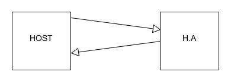

# UART

- Directory *src* to store the code
- Directory *examples* to store python usages

## Requirements

### SECTION 1: USB Interface & Protocol

#### [REQ_1000] USB IDs

The product USB IDs **must** be free shared USB VID/PID pair for CDC devices. The products can be differentiated with their serial number.

The vendor ID of the device **must** be 0x16C0.

The product ID of the device **must** be 0x05E1.

The serial number of the device **must** be XXXX.

#### [REQ_1010] USB protocol

The product **must** use a custom USB protocol. This protocol uses USB CDC and SLIP protocol to encapsulate the frames.

The frames are composed of:

- a 16 bits request code
- Data
- a 16 bits CRC

There are two possible transfer mechanisms. For each, there can be only one request at a time before receiving an answer.
- Standard request: the transfer is initiated by the host and wait for an answer from the host adapter

- Notification: the transfer is initiated by the host adapter and wait for an answer from the host

 

**Request code**:

***Requests***

Generic requests

| Code        | Function  |
| ----------- | --------- |
| `0x0000`    | Ping      |
| `0x0001`    | ItfType   |
| `0x0002`    | Version   |
| `0x0003`    | IdGet     |

UART

| Code        | Function  |
| ----------- | --------- |
| `0x3800`    | UartBegin |
| `0x3801`    | UartEscape|
| `0x3802`    | DataTX    |
| `0x3803`    | DataRXGet |
| `0x3804`    | BaudSet   |
| `0x3805`    | BaudGet   |
| `0x3806`    | SetParity |
| `0x3807`    | SetStopBit|
| `0x3808`    | SetDataSz |
| `0x3809`    | StopCom   |

***Answers***

Shared answers

| Code        | Function      |
| ----------- | ------------- |
| `0xFFFF`    | Good          |
| `0xFFFE`    | ErrGeneric    |
| `0xFFFD`    | ErrCRC        |
| `0xFFFC`    | ErrUnknownCode|
| `0xFFFB`    | ErrInvalidArgs|
| `0xFFFA`    | ErrBusy       |

Generic answers

| Code        | Function      |
| ----------- | ------------- |
| `0xFEFF`    | VersionResp   |
| `0xFEFE`    | ItfTypeResp   |
| `0xFEFD`    | IdResp        |

UART answers

| Code        | Function      |
| ----------- | ------------- |
| `0xB4FF`    | DataRX        |
| `0xB4FE`    | Baud          |

### SECTION 2: Features

#### [REQ_2000] Enable UART

The product **must** enable the UART communication when the command `0x3800` is received.

#### [REQ_2010] Disable UART

The product **must** disable the UART communication when the command `0x3801` is received.

#### [REQ_2020] Send data

The product **must** send data to one other product using UART communication when the command `0x3802` is received.

#### [REQ_2030] Receive data

The product **must** receive data from one other product using UART communication when the command `0x3803` is received.

#### [REQ_2040] Baud rate

The product **must** provide a way to change and read the baudrate. The request code to set the baudrate is `0x3804`, the request code to read the baudrate is `0x3805`. The baud rate can be out of the standards baud rates used in UART.

#### [REQ_2050] Parity

The product **must** configure the parity bit when the command `0x3806` is received.

#### [REQ_2060] Stop bits

The product **must** configure the stop bits when the command `0x3807` is received.

#### [REQ_2070] Data size

The product **must** configure the data size when the command `0x3808` is received.

#### [REQ_2080] UART pinout

The product UART TX is connected to GP0 and the UART RX is connected to GP1.

#### [REQ_2090] PIO

The product **must** use the Programmable I/O of the Pi Pico board.

#### [REQ_2100] Start of the program

The internal LED of the product **must** be turned on at the start of the firmware. The LED state **must** be inverted at each command received by the product during the execution of the firmware.

#### [REQ_2110] UART disconnected

The firmware **must** still be running when the UART connection is disconnected.

#### [REQ_2120] UART stop

The firmware **must** be able to stop the UART in the middle of a communication when the command `0x3809` is received.
